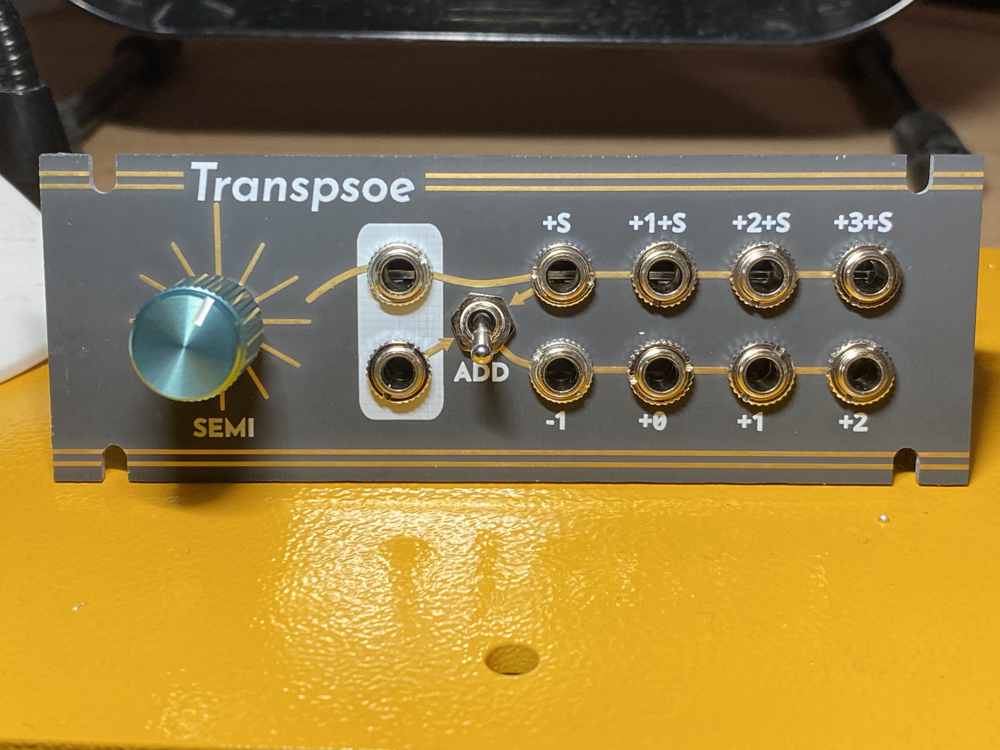

# Transpsoe

This is a Eurorack 1u 22hp module that performs pitch transposition on V/oct signals. Outputs are accurate to within 1.5mV, often better. The panel is designed for Intellijel 1u, but is (untested) compatible with Pulp Logic 1u. Build instructions can be found [here](build_instructions.md). **Note: rev 1 has not been built yet, but is only minor changes from rev 0, see the [changelog](CHANGELOG.md) for details.**

## Project Status

- [x] Complete initial CAD work
- [x] SPICE simulations
- [x] Order test board to verify footprints, board alignment, and power connector clearance
- [x] Order and assemble rev 0 PCBs and components
- [ ] Order and assemble rev 1 PCBs and components

## Known issues
- Something on channel 1 produces around -0.5 to -1mV of error in a way that is visible on the +S output (and all channel 2 outputs when summing is enabled). It does not seem to show up on the other outputs, but this might just mean its calibrated out of the voltage refs.

## Controls

Transpsoe has two inputs, 8 outputs, a toggle switch, and a rotary knob. The two rows of jacks corresponds roughly to two channels of operation.

### Inputs

The inputs are identified by white outlines. The jacks are both normed to 0V. Each input is fed to the jacks to their right. The channel summing mechanism can also feed the top input downward.

### Channel summing

The toggle switch can be used to bridge the two channels. If the toggle switch is in the down position, pointing toward the "ADD" label, then the bottom outputs behaves as if the bottom input is increased by the top input and the semitone transposition.

### Semitone transpostion

The rotary knob selects semitone transposition in 12-TET. 0 semitones corresponds to the vertical position, with the extra long radial line.  The number of semitones increases by 1 as you move clockwise. Semitone transposition applies only to the first channel unless channel summing is enabled.

### Outputs

Each output is labeled with an integer representing a number of octaves to shift up the channel's input by. The top channel is also shifted up by the number of semitones selected on the knob.

## Technical details

### Power consumption

- 12V: ~13 mA
- -12V: ~13 mA

### Calibration

1. Apply power to the module.
2. Unplug any patch cables, set the semitone knob to 0, and the summing switch to the off position.
3. Measure the first output on the top. It should be 0V, +/- 1.5mV. This is not adjustable. A substantially different value is indicative of a problem with the circuit.
4. Measure the second output on the top. It should be 1V. Adjust trimpot RV1 to get it as close as possible to 1V.
5. Measure the third and fourth outputs on the top and the first on the bottom. They should be 2V, 3V, and -1V, respectively. They should be pretty close at this point, but if they're not, you can further tune RV1 to minimize the error across the -1V, 1V, 2V, and 3V values.
6. Set the semitone knob to 1 and the summing switch to the off position.
7. Measure the first output on the top. It should be 83.33mV (1/12 mV). Adjust trimpot RV2 to tune as close to 83.33mV as you can, since any error here is going to be multiplied by up to 11.

### Voltage reference

The circuit generates a 4.096V +/- 0.1% reference using a shunt diode. A resistor divider with a trimpot is used to get a 4V reference. -1V, 1V, 2V, and 3V references are generated from the 4V reference.
