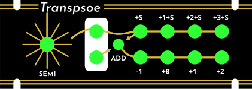

# Transpsoe

This is a **work-in-progress** Eurorack 1u 21hp module that performs pitch transposition on V/oct signals. The panel is designed for Intellijel 1u, but is (untested) compatible with Pulp Logic 1u. **This module has never been built and may be unsafe to construct**.

Note the render is slightly incorrect due to KiCad's rendering not matching OSH Park's fabrication process.

## Project Status

- [x] Complete initial CAD work
- [x] SPICE simulations
- [x] Order test board to verify footprints, board alignment, and power connector clearance
- [ ] Order and assemble rev 0 PCBs and components

## Controls

Transpsoe has two inputs, 8 outputs, a toggle switch, and a rotary knob. The two rows of jacks corresponds roughly to two channels of operation.

### Inputs

The inputs are identified by white outlines. The jacks are both normed to 0V. Each input is fed to the jacks to their right. The channel summing mechanism can also feed the top input downward.

### Channel summing

The toggle switch can be used to bridge the two channels. If the toggle switch is in the down position, pointing toward the "ADD" label, then the bottom outputs behaves as if the bottom input is increased by the top input and the semitone transposition.

### Semitone transpostion

The rotary knob selects semitone transposition in 12-TET. 0 semitones corresponds to the vertical position, with the extra long radial line.  The number of semitones increases by 1 as you move clockwise. Semitone transposition applies only to the first channel unless channel summing is enabled.

### Outputs

Each output is labeled with an integer representing a number of octaves to shift up the channel's input by. The top channel is also shifted up by the number of semitones selected on the knob.

## Technical details

### Calibration

1. Apply power to the module.
2. Set the semitone knob to 0 and the summing switch to the off position.
3. Measure the first output on the top. It should be 0V, +/- 0.5mV. This is not adjustable. A different value is indicative of a problem with the circuit.
4. Measure the second output on the top. It should be 1V. Adjust the trimpot on the back of the module to get it as close as possible to 1V.
5. Measure the third and fourth outputs on the top and the first on the bottom. They should be 2V, 3V, and -1V, respectively. They should be pretty close at this point, but if they're not, you can further tune the trimpot to minimize the error across the -1V, 1V, 2V, and 3V values.

### Voltage reference

The circuit generates a 4.096V +/- 0.1% reference using a shunt diode. A resistor divider with a trimpot is used to get a 4V reference. -1V, 1V, 2V, and 3V references are generated from the 4V reference.
